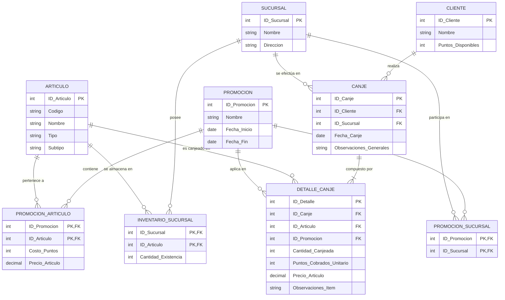

# Modelo Entidad-Relación: Canje de Puntos

## Diagrama del Modelo

```mermaid
erDiagram
    SUCURSAL {
        int ID_Sucursal PK
        string Nombre
        string Direccion
    }
    
    ARTICULO {
        int ID_Articulo PK
        string Codigo
        string Nombre
        string Tipo
        string Subtipo
    }
    
    INVENTARIO_SUCURSAL {
        int ID_Sucursal PK,FK
        int ID_Articulo PK,FK
        int Cantidad_Existencia
    }
    
    PROMOCION {
        int ID_Promocion PK
        string Nombre
        date Fecha_Inicio
        date Fecha_Fin
    }
    
    PROMOCION_ARTICULO {
        int ID_Promocion PK,FK
        int ID_Articulo PK,FK
        int Costo_Puntos
        decimal Precio_Articulo
    }

    PROMOCION_SUCURSAL {
        int ID_Promocion PK,FK
        int ID_Sucursal PK,FK
    }
    
    CLIENTE {
        int ID_Cliente PK
        string Nombre
        int Puntos_Disponibles
    }

    CANJE {
        int ID_Canje PK
        int ID_Cliente FK
        int ID_Sucursal FK
        date Fecha_Canje
        string Observaciones_Generales
    }
    
    DETALLE_CANJE {
        int ID_Detalle PK
        int ID_Canje FK
        int ID_Articulo FK
        int ID_Promocion FK
        int Cantidad_Canjeada
        int Puntos_Cobrados_Unitario
        decimal Precio_Articulo
        string Observaciones_Item
    }

    SUCURSAL ||--o{ INVENTARIO_SUCURSAL : "posee"
    ARTICULO ||--o{ INVENTARIO_SUCURSAL : "se almacena en"
    
    PROMOCION ||--o{ PROMOCION_ARTICULO : "contiene"
    ARTICULO ||--o{ PROMOCION_ARTICULO : "pertenece a"
    
    PROMOCION ||--o{ PROMOCION_SUCURSAL : "aplica en"
    SUCURSAL ||--o{ PROMOCION_SUCURSAL : "participa en"
    
    CLIENTE ||--o{ CANJE : "realiza"
    SUCURSAL ||--o{ CANJE : "se efectúa en"
    
    CANJE ||--|{ DETALLE_CANJE : "compuesto por"
    ARTICULO ||--o{ DETALLE_CANJE : "es canjeado en"
    PROMOCION ||--o{ DETALLE_CANJE : "aplica en"
```
